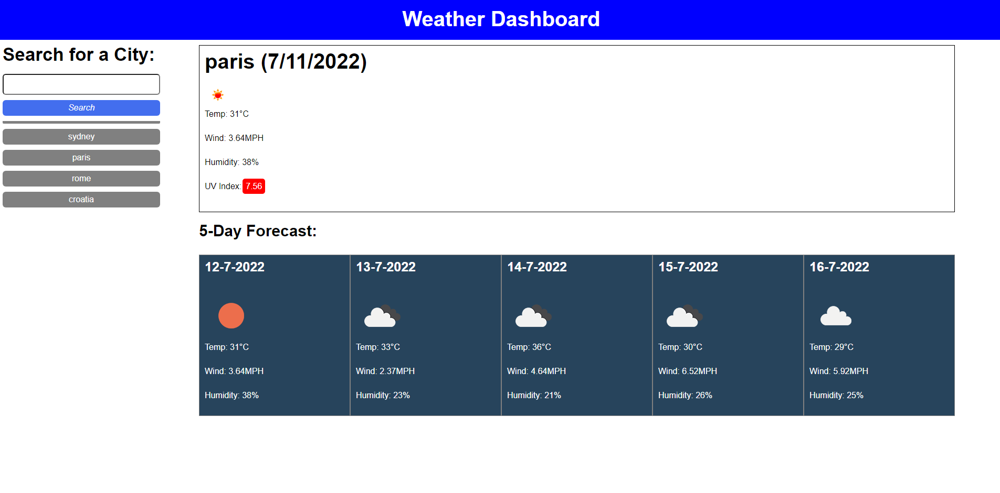

# Weather-Dashboard: JavaScript & APIs

## Task

For this challenge, I was given the task of pulling data from an api regarding the current and future weather forecast of a city. When the user searches for a city, they are presented with today's temperature, wind speed, UV index, and humidity. They are also shown the forecast for the next 5 days. Upon search, a button is created along the left hand side to allow for faster navigation.

## Submission
- Github Repo URL: https://github.com/r-r-i/Weather-Dashboard
- Deployed URL: https://r-r-i.github.io/Weather-Dashboard/

## Screenshots

